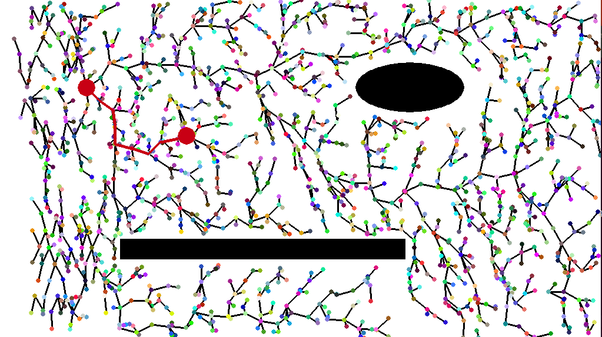

# RRT (Rapidly-exploring Random Tree)
RRT is an algorithm widely used in robotics for path planning. It takes a map of an unexplored location, then continuously builds a space-filling tree. 

This can then be used in combination with algorithms like A* to plan out paths from one point to another.

Here is an example of where my test is at right now:

As you can see, in under 2000 nodes it builds out a tree that mostly covers the map and avoids obstacles. It then picks a random point, then draws out the fastest path from the origin to the chosen goal.
There is still a lot of work to be done for this to be functional or useful, but it's a great tool for learning!

In the future, I hope to add some of the following features (this list is not exhaustive):
- Optimized paths with RRT*
- Buttons and inputs to customize runs
- Ability to automatically export images
