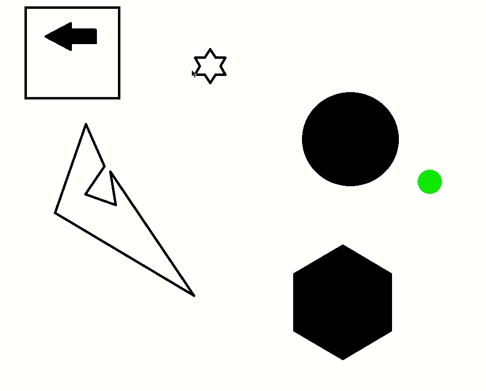

# RRT (Rapidly-exploring Random Tree)
RRT is an algorithm widely used in robotics for path planning. It takes a map of an unexplored location, then continuously builds a space-filling tree. 

This can then be used in combination with algorithms like A* to plan out paths from your origin to a designated goal.

Here is an example of what my algorithm looks at the moment:

As you can see, in under 2000 nodes it builds out a tree that covers the map and avoids obstacles. It stops building this tree once it hits the assigned goal region (marked by neon green), then the shortest path from the origin using A*.
There is still a lot of work to be done for this to be functional or useful, but it's a great tool for learning!

In the future, I hope to add some of the following features (this list is not exhaustive):
- Optimized paths with RRT*
- Buttons and inputs to customize runs
- Ability to automatically export images
